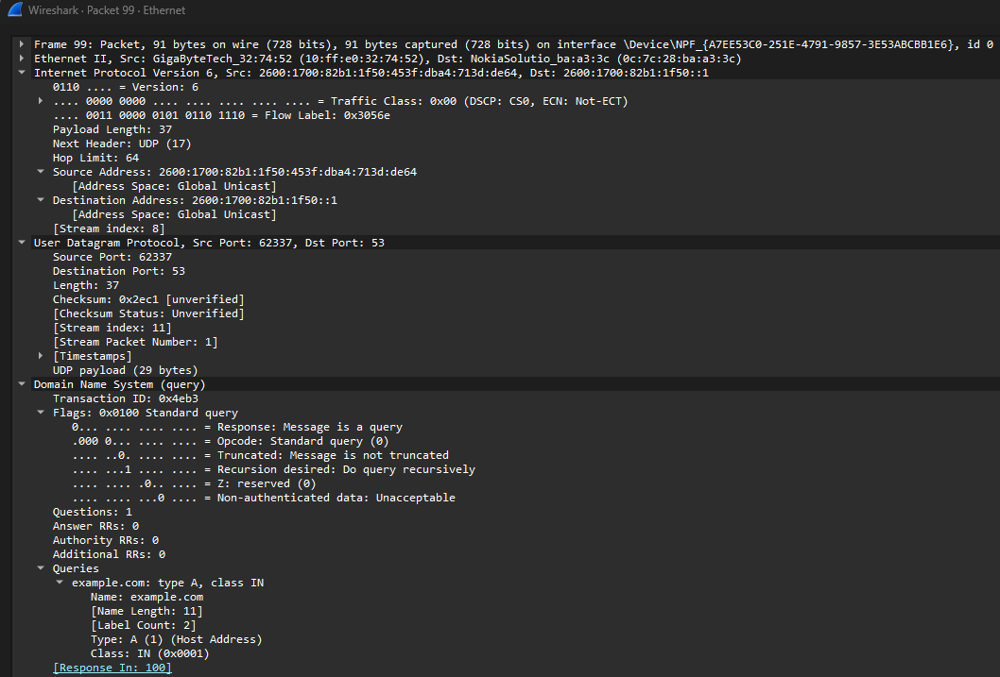
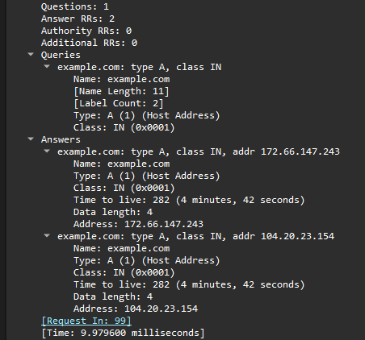

# DNS Analysis

## Objective

Analyze DNS traffic using Wireshark to understand how a client resolves domain names and how DNS queries and responses are exchanged over the network.

## Environment

* **Tool:** Wireshark
* **Operating System:** Windows 11
* **Protocol:** DNS
* **Transport:** UDP
* **DNS Port:** 53
* **Network:** Ethernet / IPv6

## Investigation

During the packet capture, I observed DNS queries generated by the Windows system.

One query attempted to resolve:

`example.com.attlocal.net`

The query was sent using UDP to port 53. The DNS server responded with a **"No such name"** response, indicating that the requested hostname did not exist.

### DNS Query

The packet contained:

* Transaction ID: `0x0002`
* Query type: `A`
* Class: `IN`
* Recursion Desired: Enabled
* Questions: `1`

The query demonstrated how a DNS client requests an IPv4 address for a hostname.



### DNS Response

The corresponding response contained:

* Transaction ID: `0x0002`
* Response Code: `3 (No such name)`
* Answers: `0`
* Authority Records: `1`

This showed that the DNS server received the request but could not resolve the requested hostname.



### Successful DNS Resolution

I then captured a successful DNS lookup for:

`example.com`

The DNS query requested an **A record**, which provides an IPv4 address.

The response returned two IPv4 addresses:

* `172.66.147.243`
* `104.20.23.154`

The response had:

* Response Code: `0 (No error)`
* Answers: `2`
* TTL: `282 seconds`

I also captured an **AAAA query**, which requests IPv6 addresses.

The response returned:

* `2606:4700:10::ac42:93f3`
* `2606:4700:10::6814:179a`

This demonstrated the difference between A records and AAAA records.

## Windows DNS Configuration

I used PowerShell to inspect the local DNS client configuration:

```powershell
Get-DnsClient
Get-DnsClientGlobalSetting
```

The Ethernet adapter reported:

`attlocal.net`

as its connection-specific DNS suffix.

The global DNS configuration showed that no custom suffix search list was configured.

This helped explain why Windows attempted to resolve the unqualified hostname using the local DNS suffix.

## Key Findings

* DNS commonly uses UDP port `53` for standard queries.
* An **A record** returns an IPv4 address.
* An **AAAA record** returns an IPv6 address.
* DNS response code `0` indicates a successful response.
* DNS response code `3` indicates that the requested name does not exist.
* DNS queries contain a transaction ID that allows the response to be associated with the original request.
* The Windows DNS client can append a connection-specific DNS suffix to names during resolution.
* DNS can operate over IPv6 while still resolving IPv4 records.

## Network+ Concepts Demonstrated

* DNS name resolution
* A and AAAA records
* UDP port 53
* DNS response codes
* IPv4 and IPv6
* DNS suffixes
* Packet-level protocol analysis
* Client/server communication

## Screenshots

### DNS Query


### DNS Response


## What I Learned

This investigation helped me understand DNS beyond simply knowing that it "translates domain names into IP addresses." By examining the packets directly, I was able to see how DNS queries are structured, how different record types work, how DNS errors are reported, and how Windows uses DNS suffixes during name resolution.
