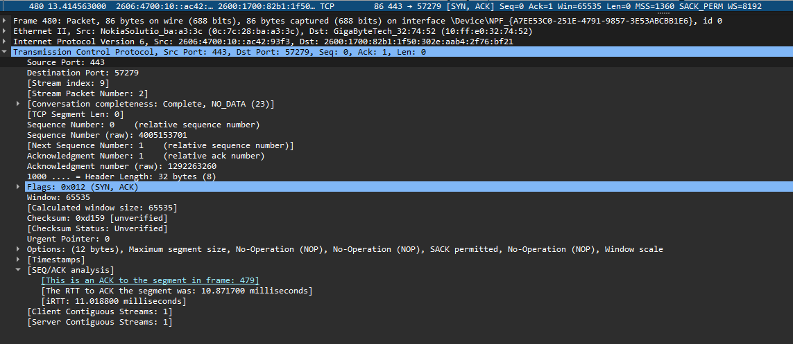
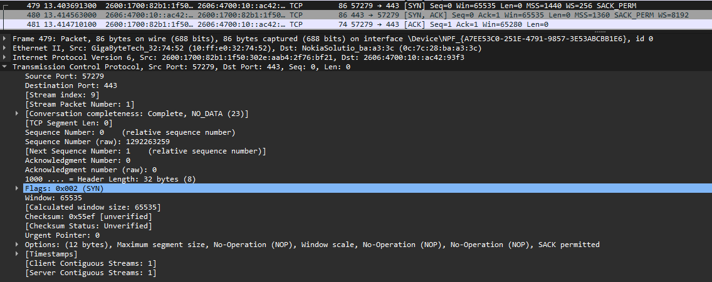

# TCP Three-Way Handshake

## Objective

Capture and analyze the TCP three-way handshake using Wireshark to understand how TCP establishes a reliable connection between a client and server.

## Environment

* **Tool:** Wireshark
* **Operating System:** Windows 11
* **Protocol:** TCP
* **Destination Port:** `443`
* **Transport:** TCP
* **Connection:** Client → HTTPS server

## Investigation

I captured a TCP connection from my Windows system to a server listening on port `443`.

The connection was established using the standard TCP three-way handshake:

1. SYN
2. SYN/ACK
3. ACK

### Packet 1 — SYN

The client initiated the connection with:

* Source Port: `57279`
* Destination Port: `443`
* Sequence Number: `0`
* Flags: `SYN`

The SYN packet is used to request a TCP connection and establish the client's initial sequence number.

The client also advertised TCP parameters including:

* Maximum Segment Size: `1440`
* Window Scale: `8`
* SACK permitted

### Packet 2 — SYN/ACK

The server responded with:

* Source Port: `443`
* Destination Port: `57279`
* Sequence Number: `0`
* Acknowledgment Number: `1`
* Flags: `SYN, ACK`

The server's ACK acknowledges the client's SYN.

The acknowledgment number of `1` indicates that the server received the client's SYN at sequence number `0` and expects sequence number `1` next.

The server also supplied its own initial sequence number.

The server advertised:

* Maximum Segment Size: `1360`
* Window Scale: `13`
* SACK permitted



### Packet 3 — ACK

The client completed the handshake with:

* Source Port: `57279`
* Destination Port: `443`
* Sequence Number: `1`
* Acknowledgment Number: `1`
* Flags: `ACK`

This final ACK acknowledges the server's SYN and completes the three-way handshake.

## Sequence Number Analysis

The handshake demonstrated that SYN consumes one sequence number even though the packet contains no application data.

The sequence progression was:

```text
Client SYN
Seq = 0
Next Seq = 1

Server SYN/ACK
Seq = 0
Ack = 1

Client ACK
Seq = 1
Ack = 1
```

Wireshark also displayed the actual raw sequence numbers, while using relative sequence numbers for easier analysis.

## Key Findings

* TCP uses a three-way handshake to establish a connection.
* SYN initiates the connection.
* SYN/ACK acknowledges the client's SYN and provides the server's own SYN.
* The final ACK acknowledges the server's SYN.
* SYN consumes one sequence number.
* TCP sequence and acknowledgment numbers track communication between both endpoints.
* Port `443` is commonly used for HTTPS traffic.
* TCP options such as MSS, window scaling, and SACK can be negotiated during the handshake.

## Network+ Concepts Demonstrated

* TCP connection establishment
* TCP flags
* SYN
* SYN/ACK
* ACK
* Sequence numbers
* Acknowledgment numbers
* TCP port 443
* MSS
* Window scaling
* SACK

## Screenshots

### Complete Three-Way Handshake



### SYN/ACK Details


## What I Learned

This investigation helped me understand the TCP three-way handshake at the packet level rather than simply memorizing SYN, SYN/ACK, and ACK. I was able to follow the sequence and acknowledgment numbers and understand how both endpoints synchronize their TCP communication before application data is exchanged.
