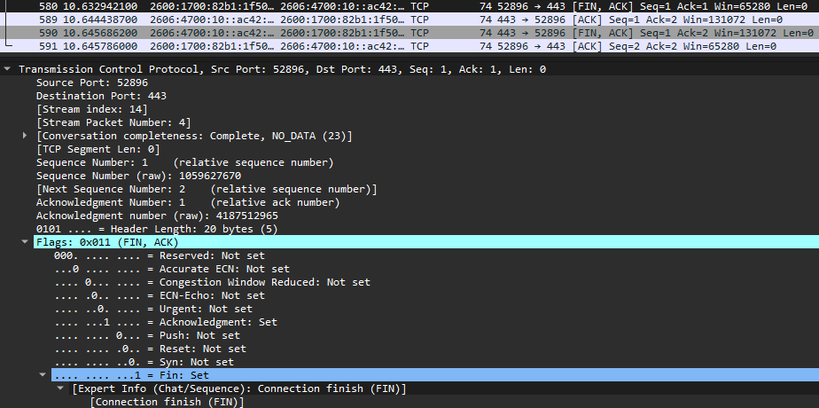
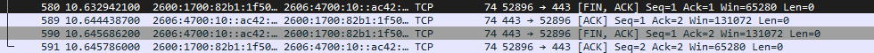

# TCP Connection Teardown

## Objective

Capture and analyze a normal TCP connection shutdown using Wireshark and understand how TCP gracefully terminates an established connection.

## Environment

* **Tool:** Wireshark
* **Operating System:** Windows 11
* **Protocol:** TCP
* **Destination Port:** `443`
* **Connection:** Client → HTTPS server

## Investigation

After establishing a TCP connection, I captured the packets involved in gracefully terminating the connection.

The connection was closed using TCP FIN and ACK packets.

The captured sequence was:

1. Client FIN/ACK
2. Server ACK
3. Server FIN/ACK
4. Client ACK

### Packet 1 — Client FIN/ACK

The client initiated the shutdown with:

* Source Port: `52896`
* Destination Port: `443`
* Sequence Number: `1`
* Acknowledgment Number: `1`
* Flags: `FIN, ACK`

The FIN flag indicates that the client has finished sending data and wants to close its side of the TCP connection.

The packet had a TCP segment length of `0`, but Wireshark showed:

`Next Sequence Number: 2`

This demonstrates that a FIN consumes one TCP sequence number.



### Packet 2 — Server ACK

The server responded with:

* Source Port: `443`
* Destination Port: `52896`
* Sequence Number: `1`
* Acknowledgment Number: `2`
* Flags: `ACK`

The server's acknowledgment number of `2` confirms that it received the client's FIN at sequence number `1`.

The server is acknowledging the client's request to close its side of the connection but has not yet sent its own FIN.

### Packet 3 — Server FIN/ACK

The server then sent:

* Source Port: `443`
* Destination Port: `52896`
* Sequence Number: `1`
* Acknowledgment Number: `2`
* Flags: `FIN, ACK`

The server's FIN indicates that it has also finished sending data and is ready to close its side of the connection.

The server's FIN consumes one sequence number:

```text
Seq = 1
Next Seq = 2
```

### Packet 4 — Final ACK

The client completed the shutdown with:

* Source Port: `52896`
* Destination Port: `443`
* Sequence Number: `2`
* Acknowledgment Number: `2`
* Flags: `ACK`

The final ACK acknowledges the server's FIN.

At this point, the TCP connection has been gracefully closed.

## Sequence Number Analysis

The teardown demonstrated that FIN consumes one sequence number even when the TCP segment contains no application data.

The sequence progression was:

```text
Client FIN
Seq = 1
Next Seq = 2

Server ACK
Ack = 2

Server FIN
Seq = 1
Next Seq = 2

Client ACK
Ack = 2
```

## Key Findings

* TCP can gracefully terminate a connection using FIN and ACK packets.
* FIN indicates that an endpoint has finished sending data.
* FIN consumes one sequence number.
* TCP is full-duplex, meaning each direction of communication can be closed independently.
* Receiving a FIN does not immediately mean both sides are closed.
* A normal TCP shutdown can involve four packets.

## Network+ Concepts Demonstrated

* TCP connection termination
* FIN flag
* ACK flag
* TCP sequence numbers
* TCP acknowledgment numbers
* Full-duplex communication
* TCP port 443
* Packet-level troubleshooting

## Screenshots

### Complete TCP Teardown



### First FIN Packet


## What I Learned

This investigation helped me understand how TCP gracefully closes an established connection. I was able to follow the FIN and ACK packets and see how sequence and acknowledgment numbers change during the shutdown process. This also demonstrated why TCP termination is different from simply stopping network communication.
