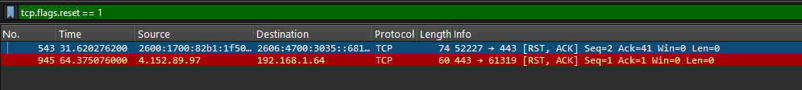
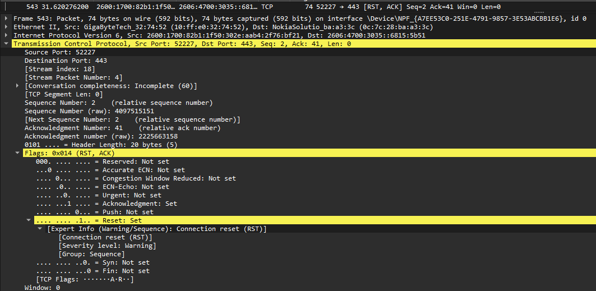

# TCP Reset

## Objective

Capture and analyze a TCP reset using Wireshark and compare an immediate TCP reset with a normal FIN-based connection shutdown.

## Environment

* **Tool:** Wireshark
* **Operating System:** Windows 11
* **Protocol:** TCP
* **Destination Port:** `443`
* **Test:** `Test-NetConnection`
* **Client Source Port:** `52227`

## Investigation

I used PowerShell's `Test-NetConnection` command to generate TCP traffic and captured the resulting packets in Wireshark.

The capture contained a TCP `RST, ACK` packet.

### RST/ACK Packet

The captured packet contained:

* Source Port: `52227`
* Destination Port: `443`
* Sequence Number: `2`
* Acknowledgment Number: `41`
* TCP Segment Length: `0`
* Flags: `RST, ACK`

Wireshark identified the packet with the expert information:

`Connection reset (RST)`

The RST flag indicates that the TCP connection is being immediately reset rather than gracefully closed using FIN packets.



## RST vs. FIN

A TCP reset is different from the graceful shutdown observed in the previous investigation.

### Graceful TCP Shutdown

```text
FIN/ACK
    ↓
ACK
    ↓
FIN/ACK
    ↓
ACK
```

A FIN indicates that an endpoint has finished sending data and wants to close its side of the connection.

### TCP Reset

```text
RST/ACK
    ↓
Connection reset
```

A reset immediately terminates the TCP connection instead of performing the normal FIN-based shutdown sequence.

## Sequence Number Analysis

The RST packet contained:

```text
Sequence Number: 2
Next Sequence Number: 2
```

Unlike SYN and FIN, the RST packet did not consume a sequence number.

The packet also contained:

```text
Acknowledgment Number: 41
```

This indicates that the sender was acknowledging data through sequence number `40` and expecting sequence number `41` next.



## Key Findings

* RST is used to immediately reset a TCP connection.
* RST is different from a graceful FIN-based shutdown.
* RST does not consume a sequence number.
* RST packets can contain an ACK.
* Wireshark identifies RST packets as connection resets.
* A TCP reset can be useful when troubleshooting unexpected connection termination.

## Network+ Concepts Demonstrated

* TCP RST flag
* TCP ACK flag
* TCP connection termination
* Sequence numbers
* Acknowledgment numbers
* TCP troubleshooting
* TCP port 443
* Wireshark expert information

## FIN vs. RST

| TCP Behavior                        | FIN               | RST             |
| ----------------------------------- | ----------------- | --------------- |
| Purpose                             | Graceful shutdown | Immediate reset |
| Normal termination                  | Yes               | No              |
| Sequence number consumed            | Yes               | No              |
| Can include ACK                     | Yes               | Yes             |
| Connection remains active afterward | No                | No              |

## Screenshots

### TCP Reset Packet


### Expanded RST Details


## What I Learned

This investigation helped me distinguish between a normal TCP connection shutdown and an immediate TCP reset. By capturing an actual RST/ACK packet, I was able to identify the RST flag, examine its sequence and acknowledgment numbers, and compare its behavior with the FIN-based shutdown from the previous investigation.
