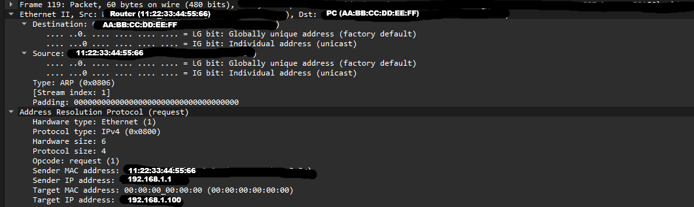

# ARP Investigation

## Objective

Capture and analyze Address Resolution Protocol (ARP) traffic using Wireshark to understand how IPv4 addresses are resolved to MAC addresses on a local Ethernet network.

---

## What is ARP?

Address Resolution Protocol (ARP) is used on IPv4 networks to determine the MAC address associated with a known IPv4 address.

IPv4 addresses operate at Layer 3, while MAC addresses operate at Layer 2. When a device needs to communicate with another device on the local network, it needs to determine the destination MAC address before sending an Ethernet frame.

---

# Frame 119 — ARP Request

Frame 119 is an ARP request sent by the router to determine the MAC address of the computer with IPv4 address `192.168.1.64`.

### Ethernet Information

- **Source:** Router
- **Destination:** PC
- **Type:** ARP (`0x0806`)

### ARP Information

- **Opcode:** Request (`1`)
- **Sender IP:** `192.168.1.254`
- **Sender MAC:** `0c:7c:28:ba:a3:3c`
- **Target IP:** `192.168.1.64`
- **Target MAC:** `00:00:00:00:00:00`

The router knows the PC's IPv4 address but does not know its MAC address.

The request is essentially asking:

> "Who has 192.168.1.64? Tell me your MAC address."

The target MAC address is set to `00:00:00:00:00:00` because the router does not yet know the MAC address associated with `192.168.1.64`.

### Frame 119 Screenshot



---

# Frame 120 — ARP Reply

Frame 120 is the ARP reply from the PC.

The PC responds to the router and identifies itself as the device using `192.168.1.64`.

### Ethernet Information

- **Source:** PC
- **Destination:** Router
- **Type:** ARP (`0x0806`)

### ARP Information

- **Opcode:** Reply (`2`)
- **Sender IP:** `192.168.1.64`
- **Sender MAC:** `10:ff:e0:32:74:52`
- **Target IP:** `192.168.1.254`
- **Target MAC:** `0c:7c:28:ba:a3:3c`

The PC is telling the router:

> "192.168.1.64 is me, and my MAC address is 10:ff:e0:32:74:52."

The router can then associate the PC's IPv4 address with its MAC address.

```text
192.168.1.64 → 10:ff:e0:32:74:52