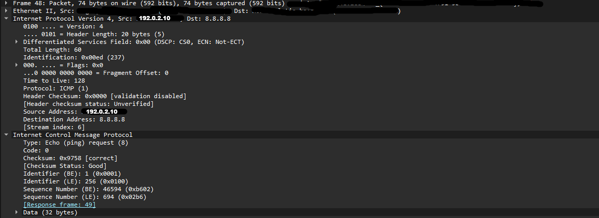
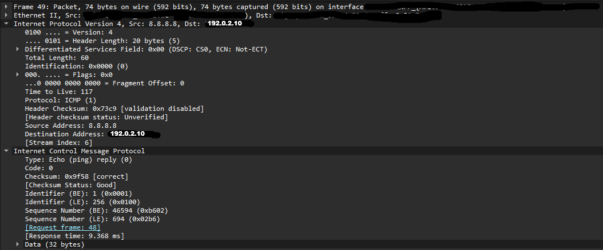

# ICMP / Ping Investigation

## Objective

Analyze ICMP traffic generated by the Windows `ping` command using Wireshark.

The purpose of this investigation was to understand how ICMP Echo Requests and Echo Replies work at the packet level and how they are carried inside IPv4 packets.

Specific objectives included:

- Identify an ICMP Echo Request
- Identify an ICMP Echo Reply
- Understand ICMP Type and Code values
- Understand the purpose of the Identifier and Sequence Number
- Examine the ICMP payload
- Understand how IPv4 carries ICMP traffic
- Examine TTL behavior
- Understand round-trip time (RTT)
- Understand how `ping` can be used for network troubleshooting
- Compare ICMP communication with TCP connection establishment

---

## Environment

### Hardware

- Personal Windows PC
- Gigabyte B650 EAGLE AX motherboard
- Realtek Ethernet adapter

### Operating System

- Windows 11 Home 64-bit

### Tools

- Wireshark
- Windows PowerShell
- `ping`

### Network

- Local IPv4 network
- Destination: `8.8.8.8`
- The local IP address was sanitized in the screenshots for the public GitHub repository.

The sanitized documentation address used in the screenshots is:

`192.0.2.10`

---

# Investigation

The investigation began by generating ICMP traffic using the Windows `ping` command:

```powershell
ping 8.8.8.8
```
# Key Findings
1. ICMP is carried inside IPv4
2. Ping uses two different ICMP message types
3. The source and destination addresses reverse
4. Identifier and Sequence Number remain consistent
5. The payload is returned
6. TTL decreases as packets travel
7. Ping measures round-trip time
8. Successful ping does not prove that an application works

# Network+ Concepts Demonstrated
IPv4
* IPv4 addressing
* Source and destination addresses
* IPv4 header
* Protocol field
* TTL
 
ICMP
* Echo Request
* Echo Reply
* ICMP Type
* ICMP Code
* ICMP checksum
* ICMP payload

Network Troubleshooting
* ping
* Connectivity testing
* Round-trip time
* Packet-level troubleshooting
* Identifying request/response relationships
* Packet Analysis

Wireshark
* Capture filtering
* Packet inspection
* IPv4 header analysis
* ICMP header analysis
* Matching request and response packets
* Examining packet fields
* Using Wireshark to understand what actually happened on the network

# What I Learned

My computer sends an ICMP Echo Request to 8.8.8.8 when I use the ping command. The request is carried inside an IPv4 packet and uses ICMP Type 8 and Code 0.

The request contains my computer's source IP, the destination IP, an Identifier, a Sequence Number, and 32 bytes of data.

The destination responds with an ICMP Echo Reply using Type 0. The source and destination IP addresses are reversed, while the Identifier, Sequence Number, and data correspond to the original request.

The Sequence Number helps identify the specific request that the reply belongs to.

The response time in this capture was 9.368 ms, which represents the approximate round-trip time between my computer and 8.8.8.8.

I also learned that TTL decreases as an IPv4 packet passes through routers. The request started with a TTL of 128, while the reply arrived with a TTL of 117. However, I cannot simply say that the difference of 11 means there were 11 routers because the two packets originated from different devices and may have started with different TTL values.

The biggest thing I learned from this investigation is that ping is testing ICMP communication, not whether an entire service or application is working. A device can respond to ping while a TCP service such as HTTPS is unavailable.

# Screenshots


