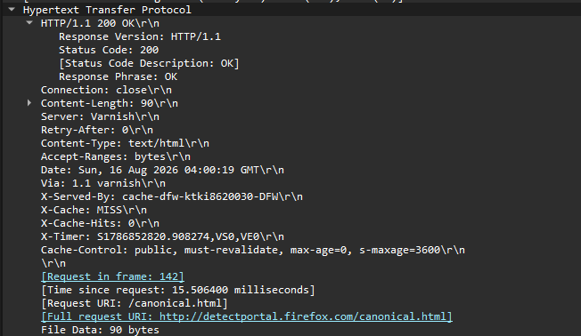
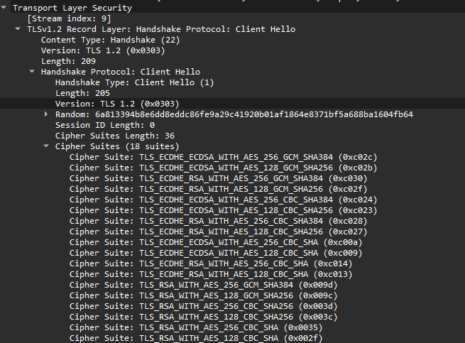
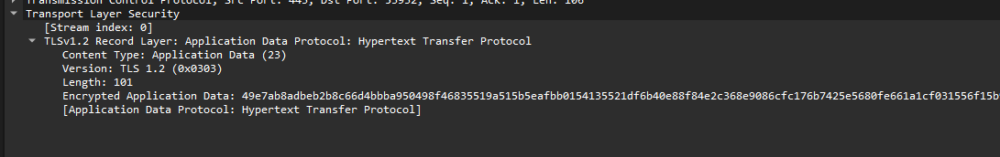

# HTTP/HTTPS Traffic Analysis

## Objective

Analyze HTTP and HTTPS traffic using Wireshark to understand the differences between unencrypted HTTP communication and encrypted HTTPS communication.

The goal was to observe an HTTP request in plaintext, examine the TLS handshake used by HTTPS, and compare the visibility of application data between the two protocols.

## Lab Environment

* Windows 11
* Wireshark
* Web browser
* Active internet connection

## Tools Used

* Wireshark
* Web browser
* HTTP
* HTTPS / TLS 1.2

## HTTP Analysis

I captured HTTP traffic while accessing a website using an unencrypted HTTP connection.

Using the Wireshark display filter:

```text
http
```

I was able to identify HTTP request and response traffic.

The HTTP request contained readable application-layer information, including the HTTP request method and host information.

Because HTTP does not encrypt the application data, the contents of the request can be viewed directly in a packet capture.

### Example HTTP Request

The captured HTTP traffic contained information similar to:

```text
GET / HTTP/1.1
Host: example.com
```

This demonstrates that HTTP application data can be inspected directly when captured from the network.

## HTTPS Analysis

I then captured HTTPS traffic and filtered the traffic using:

```text
tls
```

The HTTPS connection used TLS 1.2.

### Client Hello

The Client Hello packet contained:

* TLS version: TLS 1.2
* Server Name (SNI): `settings-win.data.microsoft.com`
* 18 supported cipher suites
* Multiple TLS extensions

The Client Hello demonstrates that the client provides the server with the TLS capabilities and cryptographic options it supports.

### Server Hello

The server responded with a Server Hello using TLS 1.2.

The server selected:

```text
TLS_ECDHE_RSA_WITH_AES_256_GCM_SHA384
```

This cipher suite was one of the cipher suites offered by the client in the Client Hello.

The Server Hello also contained additional TLS information, including the server name extension.

### Certificate

The TLS handshake included a Certificate message containing certificate data.

The certificate is part of the TLS process used to authenticate the server and establish trust.

### Server Key Exchange

The capture also contained a Server Key Exchange message using Elliptic Curve Diffie-Hellman parameters.

This is part of the process used to establish cryptographic key material for the secure connection.

## Encrypted Application Data

After the TLS handshake, I captured TLS Application Data packets.

The packet contained:

```text
Content Type: Application Data (23)
Version: TLS 1.2
Encrypted Application Data
```

Wireshark identified the application protocol as Hypertext Transfer Protocol, but the actual HTTP contents were encrypted.

Unlike the HTTP capture, I could not directly read information such as:

```text
GET / HTTP/1.1
Host: example.com
```

from the encrypted application data.

This demonstrates that HTTPS protects the HTTP application data from being directly read through a packet capture.

## HTTP vs HTTPS

| Feature                            | HTTP | HTTPS |
| ---------------------------------- | ---- | ----- |
| Application protocol               | HTTP | HTTP  |
| Encryption                         | No   | Yes   |
| TLS handshake                      | No   | Yes   |
| HTTP contents visible in Wireshark | Yes  | No    |
| Server certificate                 | No   | Yes   |
| Uses TCP                           | Yes  | Yes   |
| Common port                        | 80   | 443   |

HTTPS does not replace HTTP. Instead, HTTP is transmitted through a TLS-encrypted connection.

## Key Findings

1. HTTP application data can be viewed directly in a packet capture.
2. HTTPS uses TLS to encrypt application data.
3. The TLS Client Hello contains the client's supported cryptographic options.
4. The server selects a compatible cipher suite during the Server Hello.
5. The server provides a certificate during the TLS handshake.
6. The captured connection negotiated `TLS_ECDHE_RSA_WITH_AES_256_GCM_SHA384`.
7. HTTPS application data appeared as encrypted data rather than readable HTTP content.
8. Some connection metadata can still be visible even when application data is encrypted.

## What I Learned

This investigation helped me understand the practical difference between HTTP and HTTPS rather than only knowing that HTTPS is "more secure."

I was able to see an HTTP request directly in Wireshark and compare it with HTTPS traffic where the HTTP contents were encrypted.

I also learned how the TLS handshake establishes the parameters for a secure connection. The Client Hello provides the server with supported TLS options and cipher suites, while the Server Hello selects the options that will be used.

The most useful observation was seeing the transition from the TLS handshake to encrypted application data. Wireshark could identify the traffic as HTTP application data, but the actual contents could not be read because they were protected by TLS.

This showed me why HTTPS is important for protecting information while it travels across a network.

## Troubleshooting / Real-World Relevance

Understanding HTTP and HTTPS traffic is useful when troubleshooting network and application problems.

Wireshark can be used to determine whether:

* A connection is reaching the destination.
* A TCP connection is being established.
* TLS negotiation is occurring.
* A TLS connection is failing.
* Application data is being exchanged.
* A connection is using HTTP or HTTPS.

When HTTPS traffic is encrypted, packet captures cannot normally be used to directly inspect the HTTP contents. Instead, troubleshooting can focus on connection information, TLS negotiation, certificates, timing, retransmissions, and other visible network behavior.

## Screenshots

### HTTP Request



### HTTPS Client Hello



### HTTPS Application Data


